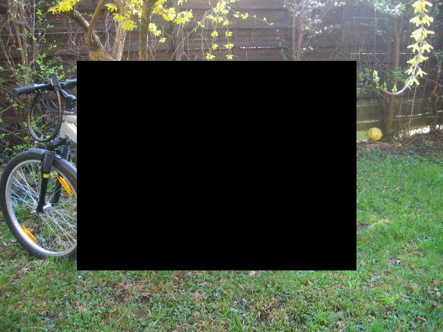

# SuperpixelGridMasksLibrary
This Python library focuses on data augmentation techniques based on superpixels. It is highly beneficial for machine learning, particularly in scenarios involving limited image datasets.

# Install
The current version of SuperpixelGridMasks Library can be installed with PyPI **(will be available soon)**.
```sh
$ pip install SuperpixelGridMasks
```

# Overview
There are different functionalities offered by this library:
- **grid_cut(path_input, num_segments, p)**: Generate images with a specified number of superpixels (*num_segments*), and transform them by setting pixel values to 0 with a probability of p.
- **grid_mean(path_input, num_segments, p)**: Generate images with a specified number of superpixels (*num_segments*), and transform them by replacing the pixel values with their mean values with a probability of p.
- **grid_mix(path_input, num_segments, p)**: Generate images with a specified number of superpixels (*num_segments*), and transform them with a probability of p into values from the following image.
- **grid_noise(path_input, num_segments, p)**: Generate images with a specified number of superpixels (*num_segments*), and transform them with a probability of p into random values.
- **shake(path_input, num_segments, p, dict_p_mode=None)**: Generate images with *num_segments* superpixels and transform them into the selected mode with a probability of p. The mode is chosen based on the probabilities defined in the *dict_p_mode* dictionary. By default, each mode is chosen with equal probability, i.e., *dict_p_mode={0: 0.25, 1: 0.25, 2: 0.25, 3: 0.25}*.
- **cutmix(path_input)**: Generate cutmix images
- **cutout(path_input)**: Generate cutout images

# Demo
| Method | Example |
| --- | --- |
|GridCut||
|GridMean||
|GridMix||
|GridNoise||
|GridShake||
|GridMix||
|GridOut||

# Basic Usage
``` python
import SuperpixelGridMasks as spxl

if __name__ == '__main__':
    spxl.cutmix(r"c:\VOC_TEST")
    spxl.cutout(r"c:\VOC_TEST")
    spxl.grid_cut(r"c:\VOC_TEST", 150, 0.4)
    spxl.grid_mean(r"c:\VOC_TEST", 150, 0.4)
    spxl.grid_mix(r"c:\VOC_TEST", 150, 0.4)
    spxl.grid_noise(r"c:\VOC_TEST", 150, 0.4)
    spxl.shake(r"c:\VOC_TEST", 150, 0.4)
```

# Team
**Project leaders:**
  - Karim Hammoudi, Université de Haute-Alsace, IRIMAS, France, karim.hammoudi@uha.fr
  - Adnane Cabani, ESIGELEC/IRSEEM, France, adnane.cabani@esigelec.fr 

Note: project leaders equally contributed to this work.

**Contributors:** <sub> (order by surname) </sub> 
  - Halim Benhabiles, Yncrea Hauts-de-France, IEMN Lille, France
  - Fadi Dornaika, University of the Basque Country, IKERBASQUE, Basque Foundation for Science, Bilbao, Spain
  - Mahmoud Melkemi, Université de Haute-Alsace, IRIMAS, France
  - Bouthaina Slika, University of the Basque Country, Spain

# Bibtex references
> Hammoudi, K., Cabani, A., Slika, B. et al. SuperpixelGridMasks Data Augmentation: Application to Precision Health and Other Real-world Data. J Healthc Inform Res 6, 442–460 (2022). <a href=https://doi.org/10.1007/s41666-022-00122-1>doi:10.1007/s41666-022-00122-1</a>

```
@Article{Hammoudi2022,
author={Hammoudi, Karim
and Cabani, Adnane
and Slika, Bouthaina
and Benhabiles, Halim
and Dornaika, Fadi
and Melkemi, Mahmoud},
title={SuperpixelGridMasks Data Augmentation: Application to Precision Health and Other Real-world Data},
journal={Journal of Healthcare Informatics Research},
year={2022},
month={Dec},
day={01},
volume={6},
number={4},
pages={442-460},
issn={2509-498X},
doi={10.1007/s41666-022-00122-1},
url={https://doi.org/10.1007/s41666-022-00122-1}
}


```
